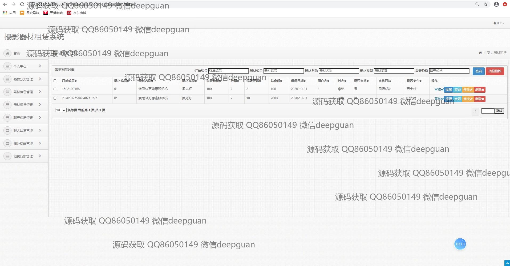
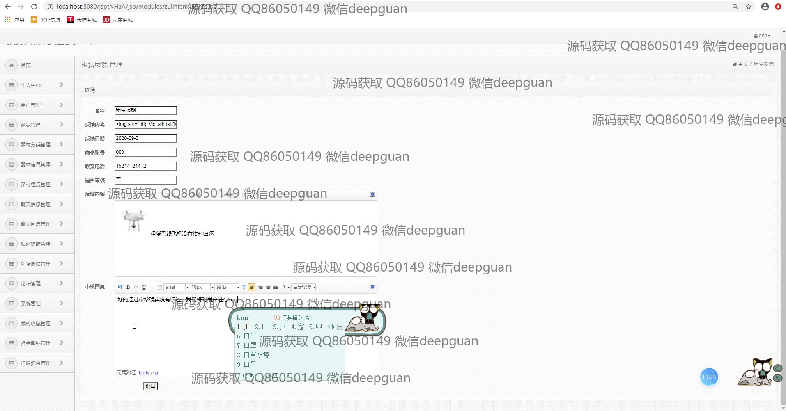

<h1 align="center">摄影器材租赁系统</h1>

## 简介
摄影器材租赁系统：角色分为管理员、用户；支持器材分类管理、订单管理、用户评论与反馈、租赁记录查看、押金管理等功能，提高管理效率和用户体验。    --计算机毕业设计源码；毕设源码；java毕业设计源码

## 联系方式

<h3 align="center">获取完整代码与数据库文件 + 微信：deepguan QQ: 86050149 QQ群: 783742310</h3>

<h3 align="center">可帮忙远程部署 包运行成功！提供远程部署、修改代码、设计文档指导、代码讲解等服务！</h3>

## 功能介绍（完整见运行截图）
管理员：基本功能包括用户和商家管理、器材信息管理、租赁及订单管理、设备图片及描述上传、新闻资讯编辑、新用户审核和反馈管理。可以管理用户的押金信息以及查看和处理用户反馈。通过侧边导航可以访问首页、订单信息管理以及押扣流程和租赁分级管理。系统提供多种操作，如添加、修改、删除和查询功能，并支持查看租赁统计数据以优化管理。  
用户：用户可以通过系统登录、注册，浏览摄影器材，并查看器材详情、价格、数量及商家信息。对感兴趣的设备进行租赁操作，可查看和管理自己的订单和租赁状态。提供个人中心模块用以修改个人信息，查看订单历史及我的收藏。用户还可以搜索并查看新闻资讯、论坛信息以及反馈自己的体验或建议，借助系统获得支持和帮助。

## 运行截图

本代码来源于网络,仅供学习参考使用!

